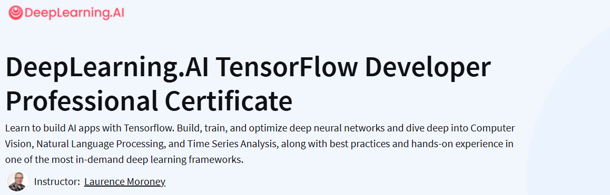

## 关于本项目

TensorFlow 开发者专业证书专项课程旨在帮助希望学习TensorFlow以构建AI应用的开发者：学习如何使用TensorFlow构建、训练和优化深度神经网络的基础知识，并深入探索计算机视觉、自然语言处理和时间序列分析。

在这个实践性的四门课程专业证书项目中，你将学习构建可扩展的基于TensorFlow的AI应用所需的工具。完成这个项目后，你将能够将你的TensorFlow新技能应用到各种问题和项目中。